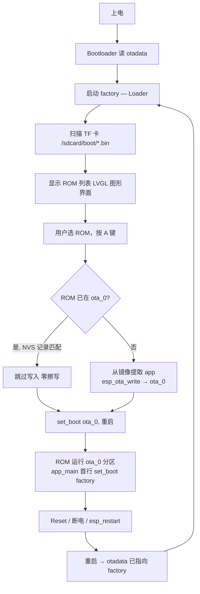

# Xiaomiao ROM Loader

学而思小喵掌机的 ROM 选择器固件。烧入 factory 分区后常驻，从 TF 卡选择 ROM 镜像并加载到 ota_0 分区运行。Reset 或断电后自动回到 Loader。

## 工作原理



## 分区表

| 分区 | 偏移 | 大小 | 用途 |
|------|------|------|------|
| bootloader | 0x1000 | ~30KB | ESP-IDF bootloader |
| partition_table | 0x8000 | 4KB | 分区表 |
| nvs | 0xA000 | 20KB | Loader 存储 ROM 状态 |
| phy_init | 0xF000 | 4KB | PHY 校准 |
| **factory** | **0x10000** | **568KB** | **Loader 固件（永不覆写）** |
| otadata | 0x9E000 | 8KB | 启动分区选择 |
| **ota_0** | **0xA0000** | **2.12MB** | **ROM 运行槽 / retro-go launcher** |
| **ota_1** | **0x2C0000** | **1.25MB** | **retro-go 模拟器核心** |

## 构建

需要 ESP-IDF v5.5.4 + Python 3.12+。

```bash
# 一键构建（编译 + 生成 merged.bin）
./build.sh

# 或手动构建
idf.py build
idf.py merge-bin -o xiaomiao-loader-merged.bin
```

## 烧录

```bash
# 通过 USB（GD32 UART 桥）
idf.py -p /dev/ttyACM0 flash

# 或用 esptool
esptool.py --chip esp32 -b 460800 write_flash 0x0 build/xiaomiao-loader-merged.bin
```

烧录接口始终可用——Loader 不触碰 bootloader 和分区表，esptool 可随时重新烧录。

## 使用

1. 把 ROM 镜像（`.bin` 或 `.img` 文件）放入 TF 卡的 `/sdcard/boot/` 目录
2. 插入 TF 卡，开机进入 Loader（按住 B 键开机也可强制进入 Loader 菜单）
3. 上下键选择 ROM，A 键加载
4. 已加载的 ROM 前面显示 `>` 标记，重复选择时跳过写入
5. 左键查看系统信息

## ROM 兼容性

Loader 自动识别两种格式：
- **Merged bin**（app 在 0x10000）：自动提取 app 段
- **App-only bin**（app 在 0x0）：直接写入
- **Full-flash 镜像**（分区表 @0x8000 + bootloader @0x1000）：retro-go `.img`/`.bin`，自动解析内嵌分区表，launcher → ota_0，retro-core → ota_1

ROM 大小上限：2.12MB（ota_0）。

### retro-go 双 app 加载

Loader 能直接加载从网络下载的 retro-go 完整镜像（无需重新编译）。启动后：

- launcher 写入 `ota_0`，模拟器核心（retro-core/gbsp/gwenesis/fmsx）写入 `ota_1`
- launcher 启动后自动识别 ota_1 上的核心，按 SD 卡的 ROM 列表生成模拟器 tab
- 选游戏后 launcher 通过 OTA 切换到 retro-core 运行
- SD 卡在每次 bootloader 启动时复位，确保 retro-core 能正常挂载 TF 卡

**分区表 offset 约束**：Loader 的 `CONFIG_PARTITION_TABLE_OFFSET` 必须和 retro-go 一致（0x8000）。这是 ESP-IDF 的编译时常量——如果两者不一致，retro-go launcher 会读不到分区表。Loader 通过缩小 bootloader 释出 0x8000 位置来满足此约束。

## 目标硬件

- ESP32-WROVER-B（4MB Flash, 8MB PSRAM）
- ST7735 SPI TFT 160x128
- MicroSD（SPI2 共享）
- 6 键导航

硬件资料和原理图见 [xueersi-idf](https://github.com/ZyoungInc/xueersi-idf)。
