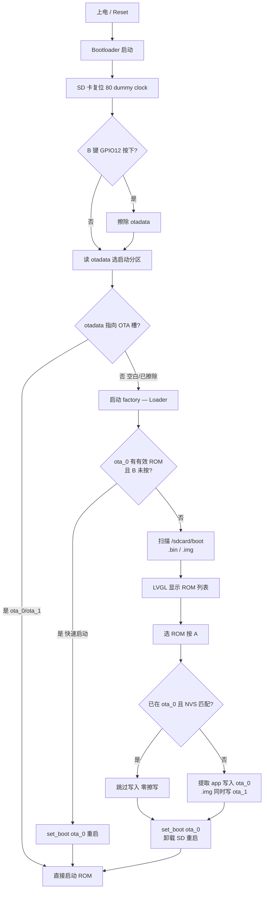

# Xiaomiao ROM Loader

学而思小喵掌机的 ROM 选择器固件。烧入 factory 分区后常驻，从 TF 卡选择 ROM 镜像并加载到 ota_0 分区运行。日常开机直接续玩上次的 ROM（Loader 快速启动，跳过菜单）；按住 B 键开机进入 Loader 菜单切换 ROM。

## 工作原理



**快速启动**：Loader（factory）启动时若 ota_0 已有有效 ROM、且未按住 B 键，会立即 `set_boot(ota_0)` 重启，跳过 LCD/LVGL 初始化以减少启动延迟。因此日常 Reset 默认续玩上次 ROM，只有按住 B 开机才进入菜单。

## 分区表

| 分区 | 偏移 | 大小 | 用途 |
|------|------|------|------|
| bootloader | 0x1000 | ~30KB | ESP-IDF bootloader |
| partition_table | 0x8000 | 4KB | 分区表 |
| nvs | 0xA000 | 20KB | Loader 存储 ROM 状态 |
| phy_init | 0xF000 | 4KB | PHY 校准 |
| **factory** | **0x10000** | **568KB** | **Loader 固件（永不覆写）** |
| otadata | 0x9E000 | 8KB | 启动分区选择 |
| **launcher** | **0xA0000** | **2.12MB** | **ROM 运行槽 (ota_0) / retro-go launcher** |
| **retro-core** | **0x2C0000** | **1.25MB** | **retro-go 模拟器核心 (ota_1)** |

`launcher` / `retro-core` 是分区标签，子类型分别为 `ota_0` / `ota_1`。`retro-core` 这个名字是 retro-go 通过 `esp_partition_find_first` 按名查找的，必须一致。

## 构建

需要 ESP-IDF v5.5.4 + Python 3.12+，LVGL 9.5.0（由 idf component manager 自动拉取）。

```bash
# 一键构建（编译 + 生成 merged.bin）
./build.sh

# 或手动构建
idf.py build
idf.py merge-bin -o xiaomiao-loader-merged.bin
```

## 烧录

```bash
# 通过 USB（GD32 UART 桥）
idf.py -p /dev/ttyACM0 flash

# 或用 esptool
esptool.py --chip esp32 -b 460800 write_flash 0x0 build/xiaomiao-loader-merged.bin
```

烧录接口始终可用——Loader 不触碰 bootloader 和分区表，esptool 可随时重新烧录。

## 使用

1. 把 ROM 镜像（`.bin` 或 `.img`）放入 TF 卡的 `/sdcard/boot/` 目录
2. 正常开机：直接运行上次加载的 ROM（Loader 快速启动，跳过菜单）
3. 按住 **B 键**开机：进入 Loader 菜单，上下键选择 ROM，A 键加载
4. 已加载的 ROM 前面显示 `>` 标记，重复选择时跳过写入（零擦写）
5. 左键查看系统信息

> 按住 B 开机时，bootloader（自定义 `sd_reset` 组件）擦除 otadata 回退到 factory，此时 nvs 保留、已加载标记仍在。长按 B 超过 5 秒会触发 IDF 内置硬恢复出厂，额外擦除 nvs，已加载标记会丢失。

## ROM 兼容性

扫描 `/sdcard/boot/` 目录，匹配 `.bin` 和 `.img` 扩展名（不区分大小写），最多 32 个。Loader 自动识别三种格式：

- **App-only bin**（magic `0xE9` 在 0x0）：直接写入
- **Merged bin**（app 在 0x10000）：自动定位并提取 app 段
- **Full-flash 镜像**（`.img` / `.bin`）：retro-go 完整镜像，解析内嵌分区表（先试 0x9000，再回退 0x8000），按标签提取 launcher 与 retro-core

ROM 大小上限：2.12MB（ota_0 / launcher）。

### retro-go 双 app 加载

Loader 能直接加载从网络下载的 retro-go 完整镜像（无需重新编译）。镜像内分区表须包含 `launcher` 和 `retro-core` 两个 app 分区。加载后：

- launcher 写入 `ota_0`，retro-core 写入 `ota_1`（依次 `set_boot` 注册到 otadata，使 retro-go 的 `have_app()` 能识别核心）
- launcher 启动后识别 ota_1 上的核心，按 SD 卡的 ROM 列表生成模拟器 tab
- 选游戏后 launcher 通过 OTA 切换到 retro-core 运行
- SD 卡在每次 bootloader 启动时由 `sd_reset` 组件复位（80 dummy clock），确保 retro-core 能正常挂载 TF 卡

**分区表 offset 约束**：Loader 的 `CONFIG_PARTITION_TABLE_OFFSET` 必须和 retro-go 一致（0x8000）。这是 ESP-IDF 的编译时常量——如果两者不一致，retro-go launcher 会读不到分区表。Loader 通过缩小 bootloader 释出 0x8000 位置来满足此约束。

## 目标硬件

- ESP32-WROVER-B（4MB Flash, 8MB PSRAM）
- ST7735 SPI TFT 160x128（旋转 90°，原生 128x160）
- MicroSD（与 LCD 共享 SPI2）
- 6 键导航

硬件资料和原理图见 [xueersi-idf](https://github.com/ZyoungInc/xueersi-idf)。
